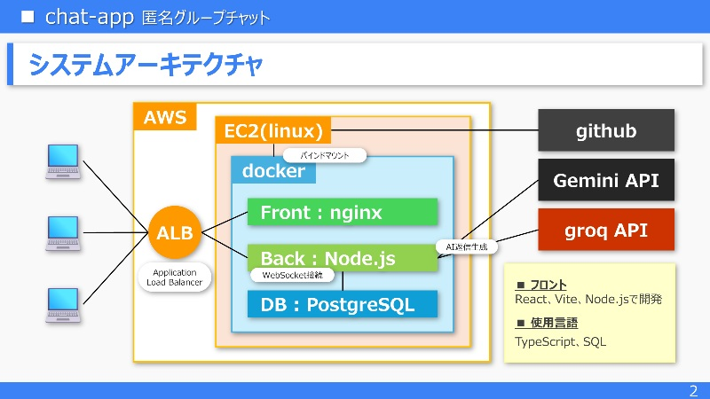

# 💬 Realtime Anonymous Chat App (chat-app)

> ユーザー登録やログインの手間を一切排除し、**アクセスした瞬間から誰でも即座に参加できる**完全匿名のリアルタイム・グループチャットアプリケーションです。
> バックエンドに常駐する生成AI（Gemini / Groq）とのシームレスな対話や、Docker・AWSを用いた堅牢なインフラ構築など、モダンなWebエンジニアリングの全体像を実装・検証しています。
> **Docker, Node.js, TypeScript, React, Vite初挑戦** の状態でアプリを完成させました！ 

---

## 🖼️️ アプリケーション画面


---

## 🚀 開発背景・目的
* **背景:** 単なる静的なCRUDアプリではなく、双方向通信（WebSocket）や外部API連携、複数コンテナによるインフラ構築など、**「動きが多く、実運用を想定したモダンなWebアプリケーション」** の全体像を短期間で習得・実装するために開発しました。
* **こだわり:** ユーザーがアクセスした際に「常に誰か（またはAI）がいて会話が弾んでいる安心感」を演出しつつ、プロの現場を意識した堅牢なアーキテクチャで構築しています。
* **学習・開発期間:** 6年前にAWSやHerokuへRuby on Railsアプリをデプロイした経験はあるもののアプリは削除済みで、さらに技術も完全に失念してしまいました。面接時にアピールできるポートフォリオやアプリがないため、シルバーウィークに思い立ちAWS、docker、Node.js、TypeScript、React、Viteの学習を開始。学習・構築・完成まで約11日で完走しました！

---

## 🛠️ システムアーキテクチャ
本アプリケーションは、スケーラビリティと分離性を考慮し、フロントとエンドは完全に別開発を実施。Docker Composeを用いて独立したコンテナで開発しました。


* **フロントエンド:** HTML, CSS, JavaScript（Nginxコンテナ上で静的配信）
* **バックエンド:** Node.js, TypeScript, WebSocket (ws)
* **データベース:** PostgreSQL
* **インフラ・デプロイ:** AWS (EC2, ALB), Docker / Docker Compose
* **外部連携API:** Google Gemini API, Groq API
#### フロントエンド開発（別コンテナにて開発）
* **フロントエンド:** React, Vite, TypeScript, Chakra UI（別コンテナにて開発）  
[👉フロントエンド開発リポジトリはこちら](https://github.com/office-diet/portfolio-react-front)
---
## 📖 詳細な設計・仕様ドキュメント
本プロジェクトの内部設計や通信仕様の詳細については、以下のドキュメントをご参照ください。
* **[データベース設計書 (Database Schema)](./docs/database-schema.md)**
  * PostgreSQLを用いたテーブル設計（`chat_logs`, `visitors`）、インデックス、初期データの構造を定義しています。
* **[WebSocket 通信仕様書 (WebSocket Specs)](./docs/websocket-specs.md)**
  * クライアント・サーバー間のリアルタイム通信におけるメッセージ型定義（TypeScript）やイベント設計をまとめています。
* **[簡易版ポートフォリオ・スライド (Google Drive)](https://drive.google.com/file/d/1QVz69x2bxvEy3y62eVaxzeCQg1Fvcegj/view?usp=sharing)**  
  * 本アプリの全体像を説明する資料。リンクからGoogle Drive上のPDFファイルをご覧いただけます。
---
## ✨ 主な機能・技術的ハイライト

1. **リアルタイム双方向通信（WebSocket）**
   * バックエンド（Node.js）とフロントエンド間でWebSocketを構築し、ラグのないメッセージ送受信を実現。
   * WebSocketの非同期性とReactの `useState` による「処理順序の矛盾」を防ぐための、すべての通信データをスタックし、スタックからステート制御を実施する工夫を実装。
   * ALBによる自動切断を回避するため、バックエンドより定期的なping送信を実施。
2. **AI（Gemini / Groq）の常駐と自動応答**
   * バックエンド側にAI連携レイヤーを実装し、チャットの盛り上がりをサポートする自動返信や対話機能を統合。
3. **プロの現場を意識したインフラ・ビルド設計**
   * フロントエンドのビルド成果物（`dist`）のみをNginxコンテナにマウント・配信することで、イメージの軽量化とセキュリティ・役割分担を明確化。
   * AWS (ALB + EC2) を用いた安定したルーティングと可用性の確保。
4. **洗練されたUI/UX**
   * Chakra UIを採用し、モダンでニュートラルなダーク/ライト調のチャットインターフェースを実現。
   * `useRef` を活用したスマートな自動スクロール制御（過去ログ閲覧時の視点固定など）。

---

## ⚙️ ローカルでの起動方法 (Getting Started)

開発環境やローカルマシンで動作させるための手順です。

### 前提条件
 * Docker / Docker Compose がインストールされていること

### 手順
1. **リポジトリのクローン**  
   ```bash
   git clone https://github.com/office-diet/portfolio-api.git
   cd portfolio-api
   ```
2. **環境変数(.env)の設定**  
   ルートディレクトリに`.env`ファイルを作成し必要なAPIキーなどを記述してください。
    ```env
    # PostgreSQL
    POSTGRES_USER=sample
    POSTGRES_PASSWORD=sample
    POSTGRES_DB=sample

    # Backend DB connection
    DB_URL=sample

    # Backend GEMINI API KEY
    GEMINI_API_KEY=sample

    # Backend GEMINI API KEY
    GROQ_API_KEY=sample
    ```
3. **Docekr Composeのビルドと起動**
     ルートディレクトリにて下記コマンドを実行。
    ```bash
    docker compose build
    docker compose up -d
    ```
    コード全体の修正を実施した際は下記コマンドがおすすめです。
    古いファイルやキャッシュの影響による意図しない挙動を防ぐことができます。
    ※DBも削除・再作成されるので注意！
    ```bash
    docker compose down -v
    docker compose build --no-cache
    docker compose up -d
    ```
    その他、バックエンドだけ修正した場合はこんな感じ
    ```bash
    docker compose build --no-cache backend
    docker compose up -d backend
    ```
4. **アクセス**
    ブラウザで `http://localhost:8080` にアクセス

### 💡今後の展望・アップデート予定
 * AWSの ECS／ECR／RDS 構成に挑戦
 * ログイン機能追加
 * メッセージ編集・削除機能追加